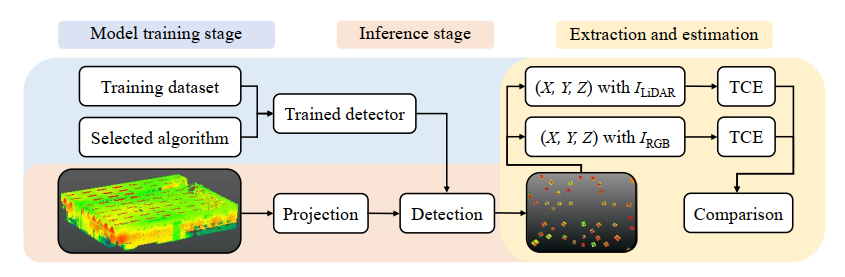

## AssessAlignment

This repository contains the implementation for the paper: ["Assessing the Alignment Between Geometry and
Colors in TLS Colored Point Clouds"]() published in the ISPRS Annals, 2023. The paper is authored by [Zhaoyi Wang](https://gseg.igp.ethz.ch/people/scientific-assistance/zhaoyi-wang.html), 
[Matej Varga](https://gseg.igp.ethz.ch/people/scientific-assistance/matej-varga.html), 
[Tomislav Medic](https://gseg.igp.ethz.ch/people/scientific-assistance/tomislav-medic.html) and 
[Andreas Wieser](https://gseg.igp.ethz.ch/people/group-head/prof-dr--andreas-wieser.html).

### Introduction

The integration of the color information f~~ro~~m RGB cameras with the point cloud geometry is used in numerous applications.
However, little attention has been paid on errors that occur when aligning colors to points in terrestrial laser scanning (TLS) point
clouds. Such errors may impact the performance of algorithms that utilize colored point clouds. Herein, we propose a procedure
for assessing the alignment between the TLS point cloud geometry and colors. The procedure is based upon identifying artificial
targets observed in both LiDAR-based point cloud intensity data and camera-based RGB data, and quantifying the quality of the
alignment using differences between the target center coordinates estimated separately from these two data sources. Experimental
results with eight scanners show that the quality of the alignment depends on the scanner, the software used for colorizing the point
clouds, and may change with changing environmental conditions. While we found the effects of misalignment to be negligible for
some scanners, they exhibited clearly systematic patterns exceeding the beam divergence, image and scan resolution for four of
the scanners. The maximum deviations were about 2 mrad perpendicular to the line-of-sight when colorizing the point clouds with
the respective manufacturer’s software or scanner in-built functions, while they were up to about 5 mrad when using a different
software. Testing the alignment quality, e.g., using the approach presented herein, is thus important for applications requiring
accurate alignment of the RGB colors with the point cloud geometry.



### Requirements

This code has been tested on the following environment:

- Ubuntu 22.04
- Python 3.8.15
- CUDA 11.3
- PyTorch 1.12.1
- GeForce RTX 3090 Ti

### Quick start

To quickly get started with AssessAlignment, follow the instructions below:

1. Clone the repository and create a virtual environment:

```
git clone https://github.com/zhaoyiww/AssessAlignment.git
conda create -n AssessAlignment python=3.8 python -y
conda activate AssessAlignment
cd AssessAlignment
```

2. Install the required dependencies:

```
sh install.sh
```

### Demo

To run the demo and evaluate the performance of the procedure, follow the steps below:

1. Download one of the provided [trained detectors](https://drive.google.com/drive/folders/1llEfIHW2JfHoR13lm6cLLFX77Idz5289) (e.g., "yolox_x_C") and save it to '**./weights/yolox_x_C**'.

2. Download an example point cloud ("example.pts") from [here](https://drive.google.com/drive/folders/1PycqRXRfaKK-GfJnlVVF7TMxR39w4rPz) and save it to '**./data/**'.

After completing the above steps, the main folder structure should look like this:

```
AssessAlignment/
├── assets/
├── data/
    └── example.pts
├── src/
    ├── estimation/
        ├── estimation.m
        └── functions/
    ├── detection.py
    ├── projection.py
    └── visualization.py
├── weights/
    └── yolox_x_C/
        ├── detector.pth
        └── yolox_x.py
├── YOLOX/
├── demo.py
├── install.sh
├── README.md   
└── requirement.txt  
```

3. To generate the results for the given point cloud, run the following command:

```
cd AssessAlignment
python demo.py 
```

Once the processing is complete, the results of projection, detection, and extraction can be found in the folder '**./data/demo/results/**'. You can also check an example of the detection result [here](./assets/detected_result0.jpg).

4. To estimate the center coordinates of artificial targets, run '**./src/estimation/estimation.m**' in MATLAB.

5. Finally, run '**../src/visualization.py**' to obtain the visualization result. All the results can be found in the folder '**./data/demo/results/**'.

**Note**: The code for target center estimation is based on the work described in this [paper](https://www.mdpi.com/2072-4292/11/7/845). If you use it for your research, please make sure to cite their paper.


### Optional

In addition to the script provided for infering the results using [YOLOX](https://github.com/Megvii-BaseDetection/YOLOX), we have also included scripts and trained detectors based on other detection algorithms. For better target detection results, we recommend using a two-stage detection algorithm such as Faster R-CNN. The two-stage detection algorithms implemented in this repository are based on the [MMDetection](https://github.com/open-mmlab/mmdetection) toolbox. We utilized version [2.25.3](https://github.com/open-mmlab/mmdetection/releases/tag/v2.25.3) of MMDetection for this implementation. Please refer to their official documentation for any updates if you are using the latest version.

Furthermore, we provide a trained detector based on YOLOv7. Before utilizing this detector, please follow the instructions in their official repository [YOLOv7](https://github.com/WongKinYiu/yolov7) to install it.

### Citation

If you find this repository is useful for your work, please consider citing the following paper:

```
@article{
  title={Assessing the Alignment Between Geometry and Colors in TLS Colored Point Clouds},
  author={Zhaoyi Wang, Matej Varga, Tomislav Medic, Andreas Wieser},
  journal={International Annals of the Photogrammetry, Remote Sensing and Spatial Information Sciences},
  volume={},
  pages={},
  year={2023}
}
```
